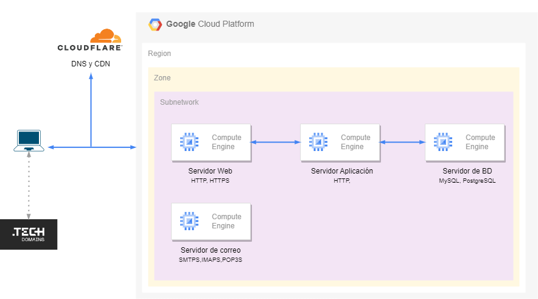

# 
# Redes de Computadoras

## Proyecto: Servicios en la nube de GCP

## Objetivo:
* El estudiante implementará una infraestructura de servidores en la nube para ofrecer un servicio web.
* El estudiante conocerá el proceso para contratar, configurar y poner en un ambiente de producción una aplicación web completa.
* El estudiante pondrá en práctica los conceptos vistos en las clases de teoría y laboratorio como son los protocolos HTTP, HTTPS, DNS, SSH, SMTPS, manejador de bases de datos, servidor proxy para caché, contratación de un dominio, registros DNS, entre otros.

## Requerimientos

### Diagrama general de conexión

### Obtener un nombre de dominio
* Obtener un dominio que será utilizado para todo el proyecto, por ejemplo el dominio *proyectoredes.tech*.
* Se recomienda que sea a través de un proveedor que lo ofrezca de forma gratuita. Por ejemplo a través de la adhesión al programa [Github Student Developer Pack](https://education.github.com/pack), en el que varios proveedores ofrecen dominios gratuitos, se recomienda obtenerlo con [.tech DOMAINS](https://get.tech/github-student-developer-pack), que ofrece el dominio gratuito *.tech* de nivel superior o TLD (*Top Level Domain*)

### Contratación de servidores virtuales
* Contratación de cuatro servidores virtuales para albergar los siguientes servicios:
  * Web Server (Compute Engine), tendrá asociado el dominio a una dirección IP fija, y sólo tendrá instalado el servidor web, por ejemplo el servidor Apache HTTPD. Deberá contar con un alias *www*, por ejemplo *www.proyectoredes.tech*, y ofrecerá el servicio por el protocolo HTTPS. Será accesible desde internet tanto por el protocolo IPv4 como por el protocolo IPv6, tomar en cuenta este punto para hacer las configuraciones necesarias de los registros DNS.
  * App Server (Compute Engine), ofrecerá el servicio de la aplicación, únicamente será accesible desde la subred interna usando una dirección IPv4 privada.
  * Data Server (Compute Engine), ofrecerá el servicio de almacenamiento y gestión de datos, únicamente será accesible desde la subred interna usando una dirección IPv4 privada.
  * Email Server (Compute Engine), ofrecerá el servicio de correo electrónico usando el protocolo SMTPS. Se configurarán los registros DNS necesarios para su correcto funcionamiento, además de contar con una buena configuración de seguridad. Será accesible desde internet tanto por el protocolo IPv4 como por el protocolo IPv6, tomar en cuenta este punto para hacer las configuraciones necesarias de los registros DNS.

Para que las instancias cuenten con ambos protocolos IPv4 e IPv6, será necesario crear una nueva red de VPC y dentro de ésta crear una subred que permita tener ambas pilas (IPv4 e IPv6). La nueva red de VPC deberá de crearse en la misma región y zona de disponibilidad de GCP en la que tengan las instancias.

Todas las instancias deberán crearse en la misma Región y zona para que se puedan comunicar sin tener que hacer configuraciones adicionales de red. Se recomienda crear las cuatro instancias como primer punto, y se deberán de conectar a la nueva red de VPC creada previamente.

### Uso de una CDN (*Content Delivery Network*)
* Deberán configurar una CDN, se recomienda usar el servicio gratuito de Clouflare que permite crear tres reglas o *Pages rules* de forma gratuita. Se recomienda dejar este requisito como uno de los últimos a configurar.

## Desarrollo

### Instalación y configuración del Web Server
* Instalar un servidor web, como Apache HTTPD, Nginx, etc.
* Instalar y configurar lo necesario para las conexiones a través de HTTPS.
* El sitio web deberá tener configurado un certificado para las conexiones HTTPS, para esto se usará [Let's encrypt](https://letsencrypt.org), se recomienda hacer la configuración a través del [Cerbot](https://certbot.eff.org) de la EFF.
* Este servidor web actuará como Proxy Web para la instancia en donde se encuentra la aplicación o App Server. Para ello hay que configurar el servidor web como *Reverse proxy*, para que redirija las peticiones HTTP de los clientes hacia el App Server y viceversa.

### Configuración de los registros DNS, de una CDN y del uso de HTTPS
* Configuración de los registros DNS necesarios. Se usará el servicio gratuito de [Cloudflare](https://www.cloudflare.com). Se recomienda que en la creación y configuración de los registros de DNS de Cloudflare, se deshabilite la opción de *Proxied*, para que únicamente se use el servicio de DNS de Cloudflare, posteriormente para la configuración de las reglas de CDN o *Page rules* se tendrá que habilitar.
* Para verificar las configuraciones de los registros DNS se sugiere usar el siguiente comando: `dig @ip_dns_cloudflare registro_DNS dominio`, por ejemplo,  `dig @1.1.1.1 A proyectoredes.tech`. Recordar habilitar la opción de *Proxied* después de verificar que los registros estén correctamente configurados, cuando así aplique.
* Se deberá indicar al provedor del dominio como *.tech DOMAINS*, que se usarán los DNS de Cloudflare, es decir, se hará el proceso de delegación de zonas.
* Deberá estar asociado el nombre de dominio a la dirección IP de su servidor web.
* Se podrá consultar su sitio web de forma exitosa a través de por ejemplo, *proyectoredes.tech* o *www.proyectoredes.tech*.
* También se podrá consultar su sitio web usando una dirección IPv6, es decir su registros DNS deberán estar configurados para este tipo de peticiones.
* Para el punto anterior se recomienda usar Teredo para probar la conexión del cliente hacia el sitio web a través de IPv6, si es que su ISP no provee el servicio de IPv6.
* Configurar los registros DNS necesarios, los mínimos son los siguientes:

Registros DNS                    |
---------------------------------|
Registro A (Web Server)          |
Registro AAAA (Web Server)       |
Registro CNAME (Web Server)    	 |
Registro A (Email Server)        |
Registro AAAA (Email Server)     |
Registro PTR (Email Server)*     |
Registro MX                      |
Registro TXT (datos de SPF)      | 	
Registro TXT (datos de DKIM)     |

* Cloudflare permite la configuración gratuita de hasta tres reglas de la caché de su sitio web en la CDN o *Page rules*, deberán configurar estas reglas con base en su aplicación web. Esta configuración la pueden realizar una vez que ya tengan programada su aplicación. Se recomienda que las reglas sean para hojas de estilo (CSS), imágenes y/o programas en JavaScript. Se recomienda dejar este requisito como uno de los últimos a configurar.
* Se deberán hacer las configuraciones necesarias para usar la CDN de Cloudflare y que ésta se conecte por HTTPS al Web Server, por lo que se recomienda el uso del modo [Full (strict)](https://developers.cloudflare.com/ssl/origin-configuration/ssl-modes/full-strict/) en la configuración de Cloudflare.

Hasta este punto su sitio web ya podría ser consultado desde cualquier lugar de internet colocando su URL en un navegador web, usando una conexión de direcciones IPv4. Debido a que aún no se realiza la aplicación ni la configuración del *Reverse Proxy*, se mostrará la pantalla inicial de Apache. Las pruebas con IPv6 se pueden dejar como uno de los últimos puntos a trabajar.

### Instalación y configuración de los servidores de aplicación y de base de datos
* Instalar un manejador de bases de datos de acuerdo a las necesidades de la aplicación, puede ser MariaDB, PostgreSQL, MongoDB, etc., en el Data Server.
* La lógica de la aplicación residirá en el App Server, por lo que se tendrá que configurar el servidor web para que se conecte a este servidor en donde se estará ejecutando los programas de la aplicación y regresarán el resultado al servidor web para que este último envíe la respuesta al usuario. Es decir, se deberá de configurar un *Reverse proxy* entre el servidor web y el servidor de aplicación.	 
* Las conexiones a la base de datos desde la aplicación se harán a través de un canal cifrado.
* Las conexiones entre el Web Server -- App Server -- Data Server se harán a través de las direcciones IPv4 privadas.

### Programación de la aplicación.
* Al menos la aplicación consistirá en un *Login*, es decir, al menos deberá contar con autenticación de los usuarios a través de contraseñas, los usuarios y las contraseñas residirán en la base de datos, por lo que se tendrán que hacer consultas a ésta.
* Se otorgarán puntos extras sobre la calificación del proyecto si la aplicación tiene más funcionalidades. Se recomienda una aplicación sencilla que no les involucre demasiado tiempo. También pueden instalar una aplicación ya hecha como cualquier CMS (*Content Management System*).
* El lenguaje de programación, y en su caso el framework de desarrollo, se dejará a elección de cada equipo.
* El código deberá estar en un proyecto de GitLab o GitHub, y se deberá configurar este repositorio en el servidor de aplicación, tal y como se hizo en las prácticas pasadas.

### Configuración de un servidor de correo electrónico.
* Configurar un servidor para recibir y enviar correo electrónico con el mismo dominio contratado.
* Para este punto la seguridad cobra mayor relevancia, por lo que deberán configurar correctamente el servidor para que no sea usado por terceros para mandar spam.
* No debe estar en *open relay*.
* Se deberán de configurar también los registros DNS para correo electrónico: para dirigir el correo electrónico del dominio al servidor de correo electrónico; para verificar la propiedad del dominio; para identificar qué servidor de correo puede enviar correos a nombre del dominio configurado.
* Deberán de usar los protocolos SMTPS, IMAP y POP3.
* Deberán de configurar un cliente de correo, en un equipo propio, para la consulta del correo de su servidor, como Thunderbird, Outlook, Mail, etc.
* Configurar el servicio de SMTPS usando un certificado creado con Let's encrypt.
* Puntos extras sobre la calificación si configuran IMAPS y POP3S.
* Puntos extras sobre la calificación si instalan un sitio web para la consulta de correo electrónico, en tal caso también deberá de usar HTTPS.
* Se recomienda usar el software [Mail-in-a-Box](https://mailinabox.email) para facilitar la instalación de todo el sistema de correo electrónico. Revisar los requisitos para su instalación para crear la instancia en GCP de acuerdo a lo solicitado. Mail-in-a-Box instala y configura los siguientes software, Postfix, Dovecot, Roundcube, Nextcloud, Apache SpamAssassin, Postgrey, Nginx, entre otros, para contar con un sistema completo de correo electrónico.
* Antes de enviar un correo electrónico de prueba, deberá de estar configurados los registros DNS necesarios, en caso contrario, cualquier otro sistema de correo electrónico que reciba el correo lo podría marcar como spam.

### Consideraciones sobre seguridad de la información
Debido a que sus servidores estarán expuestos en Internet, deberán de realizar unas configuraciones mínimas de seguridad.
* Una vez instalado todo el software necesario en los App Server y Data Server, quitarles la dirección IPv4 pública, de esta forma no podrán ser accedidos desde internet, disminuyendo así los riesgos de seguridad de tenerlos expuestos. En un esquema más completo éstos dos servidores deben estar en una red privada que permita las conexiones salientes a internet a través de un NAT, sin embargo, debido a los límites en los créditos de GCP en este proyecto no se hará esa configuración.
* Configurar el servidor de aplicación para que solamente acepte conexiones HTTP del servidor web.
* Configurar el servidor de base de datos para que solamente acepte conexiones al manejador de bases de datos del servidor de aplicación, y viceversa.
* Para la administración conectarse a través de SSH a los servidores.
* No permitir la conexión remota por SSH al usuario root.
* Crear un usuario dentro del manejador de bases de datos que solamente tenga permisos sobre la base de datos de la aplicación, no usar root para las conexiones de la aplicación.
* No almacenar en claro la contraseña de los usuarios en la base de datos, utilizar un esquema de hashing.
* El servidor web no deberá de listar ni archivos ni directorios.
* Instalar y configurar fail2ban para el servicio de SSH para bloquear intentos de conexión no autorizados  que se hace por fuerza bruta.
* Programar de forma segura al menos la autenticación de usuario y contraseña, filtrando el contenido de los campos que se reciben desde el usuario para evitar un SQL injection.
* Desinstalar servicios que no se usen en los servidores.

## Condiciones de entrega
* El proyecto lo podrán realizar en equipos de tres estudiantes.
* Entregar un reporte completo en PDF que contenga al menos:
    * Diagrama de red de los servidores, indicando direcciones IP.
    * Registros DNS configurados.
    * Resumen de las configuraciones del Web Server, App Server, Data Server y Email Server.
    * Esquema de la base de datos.
    * Objetivo de la aplicación (redactado para un usuario).
    * Uso de la aplicación (breve descripción de como usarla con capturas de pantalla, pensando en un usuario).
    * Comentarios sobre el desarrollo del proyecto.
    * Evidencia que compruebe que cada requerimiento ha sido cubierto, debido a que no habrá una exposición, el documento será la única forma de demostrar que se cumplió con lo solicitado.
    * Deberán dejar funcionando sus servicios durante 15 días a partir de la fecha de entrega del proyecto.
    * Subir el documento PDF a Moodle.
* Se podrán hacer preguntas en clase y por medio del canal de Discord destinado para ello.
* Se usará la Rúbrica para calificar el trabajo del equipo.
* Se deberá entregar el proyecto el 16 de octubre. NO habrá prórroga en la fecha de entrega.

## Algunas definiciones
* CDN: es una plataforma de servidores altamente distribuida que ayuda a minimizar los retrasos en la carga de contenidos de páginas web al reducir la distancia física entre el servidor y el usuario. De esta manera, usuarios de todo el mundo puedan visualizar el mismo contenido de alta calidad sin tiempos de carga lentos. *Akamai*

## Rúbrica de calificación

Registros DNS (27 pts)            | No se hizo (0 pts) | No se hizo en la CDN (1 pts) | Se hizo en la CDN, configuración incorrecta (2 pts) | Se hizo en la CDN, configuración correcta (3 pts) |
---------------------------------|--------------------|------------------------------|------------------------------------------------------|---------------------------------------------------|
Registro A (Web Server)          |                    |                              |                                                      |                                                   |
Registro AAAA (Web Server)       |                    |                              |                                                      |                                                   |
Registro CNAME (Web Server)    	 |                    |                              |                                                      |                                                   |
Registro A (Email Server)        |                    |                              |                                                      |                                                   |
Registro AAAA (Email Server)     |                    |                              |                                                      |                                                   |
Registro PTR (Email Server)*     |                    |                              |                                                      |                                                   |
Registro MX                      |                    |                              |                                                      |                                                   |
Registro TXT (datos de SPF)      |                    |                              |                                                      |                                                   |
Registro TXT (datos de DKIM)     |                    |                              |                                                      |                                                   |

Proxy web (20 pts)                           | No se hizo (0 pts) | Configuración incorrecta (2 pts) | Configuración correcta (4 pts) |
---------------------------------------------|--------------------|----------------------------------|--------------------------------|
Configuración del Reverse Proxy              |                    |                                  |                                |
Certificado de Let's Encrypt                 |                    |                                  |                                |
Redirecciona de HTTP a HTTPS                 |                    |                                  |                                |
No permite listar ni directorios ni archivos |                    |                                  |                                |
Se puede consultar con IPv6                  |                    |                                  |                                |
Está configurado con HTTP2                   |                    |                                  |                                |

App server (28 pts + 10 pts extras)                 |                    |                       |
----------------------------------------------------|--------------------|-----------------------|
Se tiene una aplicación                             | No (0 pts)         | Si (4 pts)            |
No permite SQLi                                     | Lo permite (0 pts) | No lo permite (8 pts) |
No permite XSS                                      | Lo permite (0 pts) | No lo permite (8 pts) |
Funcionalidad de autenticación                      | No (0 pts)         | Si (4 pts)            |
Sólo permite conexiones del Proxy Web y Data Server | No (0 pts)         | Si (4 pts)            |
La aplicación tiene más funcionalidades             | No (0 pts)         | Si (10 pts extras)    |

Data server (32 pts)                                            | No se hizo (0 pts) | Configuración incorrecta (2 pts) |  Configuración correcta (8 pts) |
----------------------------------------------------------------|--------------------|----------------------------------|---------------------------------|
No almacena las contraseñas en claro                            |                    |                                  |                                 |
Sólo permite conexiones desde el App Server                     |                    |                                  |                                 |
Conexiones cifradas a la base de datos                          |                    |                                  |                                 |
Usuario único y restringido para las consultas de la aplicación |                    |                                  |                                 |

Configuración de la CDN (12 pts)          |                    |                                  |                                |                     |
-----------------------------------------|--------------------|----------------------------------|--------------------------------|---------------------|
Reglas de CDN (*Cloudflare Pages rules*) | No se hizo (0 pts) | Configuración incorrecta (1 pts) | Configuración correcta (6 pts) |                     |
End-to-end HTTPS, SSL options            | Off (0 pts)        | Flexible (1 pts)                 | Full (4 pts)                   | Full strict (6 pts) |

Otras configuraciones de seguridad (8 pts)   | No se hizo (0 pts) | En algunas instancias (1 pts) |  En todas las instancias (4 pts) |
---------------------------------------------|--------------------|-------------------------------|----------------------------------|
No permite la conexión remota por SSH a root |                    |                               |                                  |
Uso de fail2ban                              |                    |                               |                                  |

Email server (8 pts)                         | No se hizo (0 pts) | En algunas instancias (1 pts) |  En todas las instancias (4 pts) |
---------------------------------------------|--------------------|-------------------------------|----------------------------------|
Envía correo electrónico                     |
Recibe correo electrónico                    |
Se puede consultar con IPv6                  |
Sin Open Relay                               |
SMTPS con certificados de Let's Encrypt      |
Configurado con IMAP                         |
Configurado con POP3                         |
Conexión con un cliente de correo            |
Configurado con IMAPS                        |
Configurado con POP3S                        |
Consulta web del correo                      |

Documentación (12 pts)                     | No lo incluye (0 pts) | Incompleto (1 pts) | Completo (2 pts) |
-------------------------------------------|-----------------------|--------------------|------------------|
Diagrama de red con direcciones IP         |                       |                    |                  |
Registros DNS configurados                 |                       |                    |                  |
Configuración Proxy Web                    |                       |                    |                  |
Configuración App server                   |                       |                    |                  |
Configuración Data server                  |                       |                    |                  |
Configuración Email server                 |                       |                    |                  |
Esquema de la DB o almacenamiento de datos |                       |                    |                  |
Descripción de la aplicación               |                       |                    |                  |
Manual de uso de la aplicación             |                       |                    |                  |
Comentarios sobre el proyecto              |                       |                    |                  |
Referencias técnicas                       |                       |                    |                  |
Sin faltas de ortografía                   |                       |                    |                  |

